# SaloonEase 💇‍♀️💈

## 📌 Project Description

SaloonEase is a **Salon Booking System** developed as the **final project for the Advanced API Development (AAD) module**.  

The system is built using **Spring Boot, Java, MySQL, and JWT Authentication** for the backend, with a responsive **HTML, CSS, and JavaScript frontend**.  

It allows **customers** to register, book appointments, make payments via **PayHere**, and manage their profiles.  
Meanwhile, **admins** can manage services, approve appointments, handle payments, generate bills, and oversee customer reviews.  

The project provides an **end-to-end salon management solution**, integrating appointment booking, secure payments, email notifications, and reporting for better administration.

---

## 📸 Screenshots

### 🏠 Home Page  
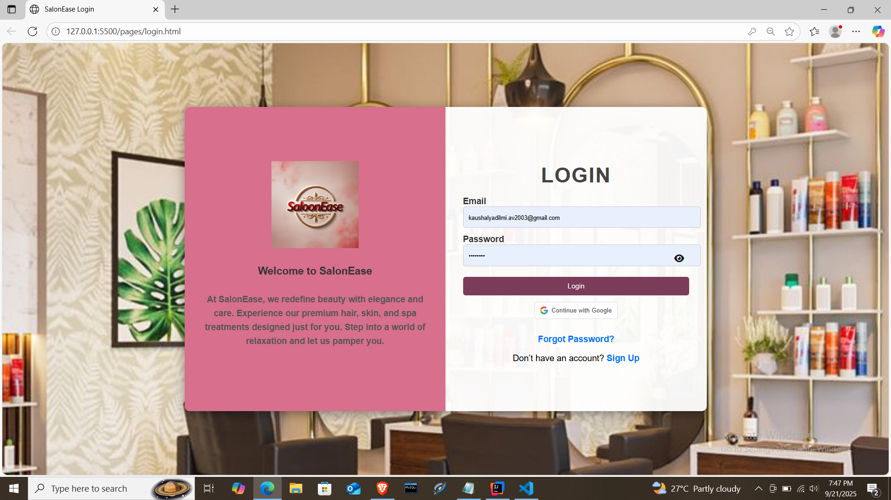

### 👩‍💼 Admin Dashboard  
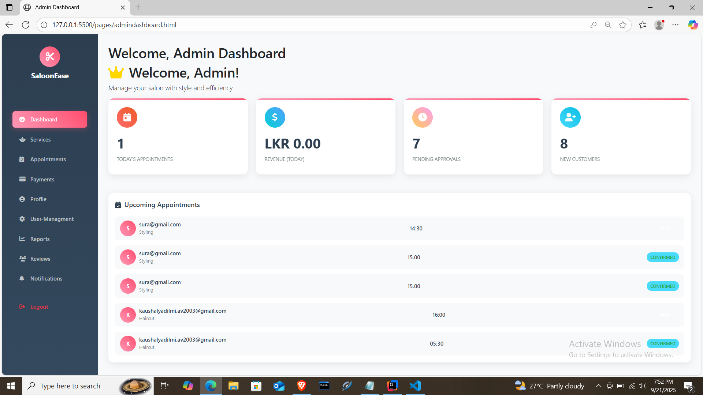

### 📅 Admin Appointments Management
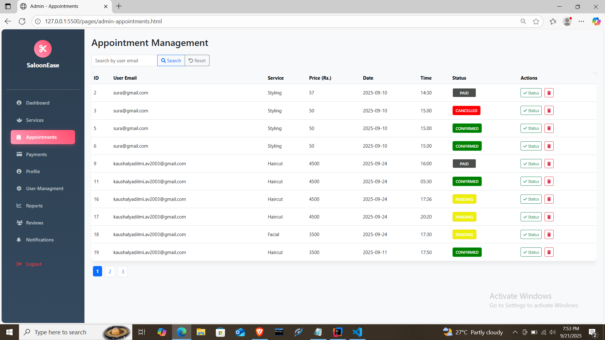

### 📊 Admin Reports  
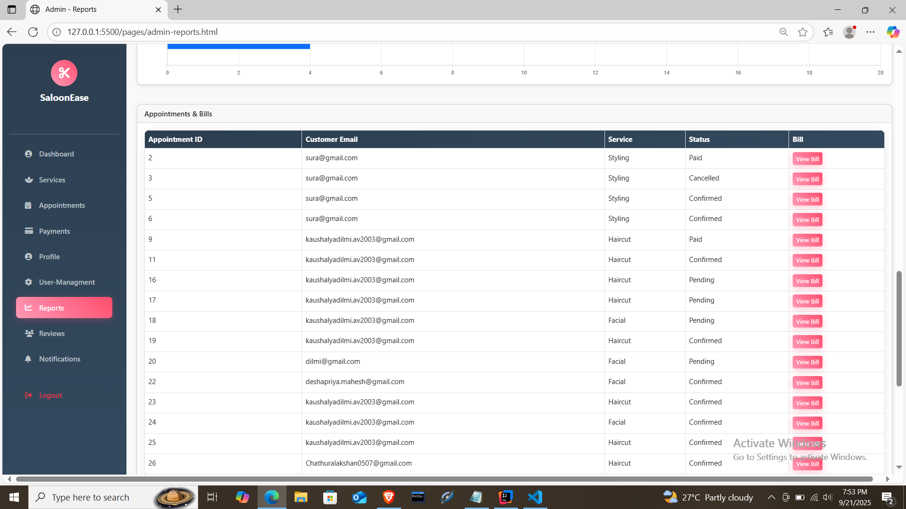

### ⭐ Admin Reviews Management
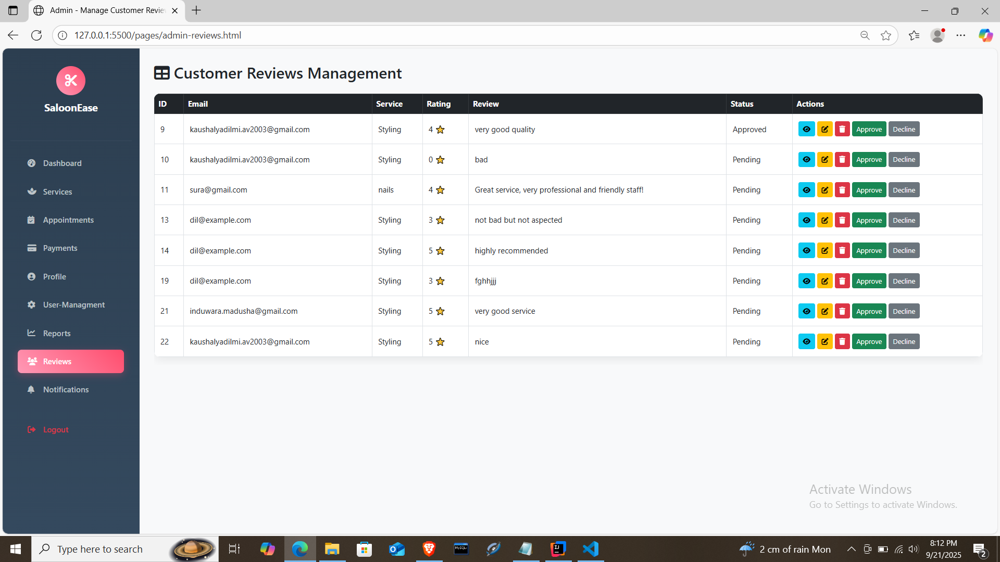

### 🔧 Admin Services Management
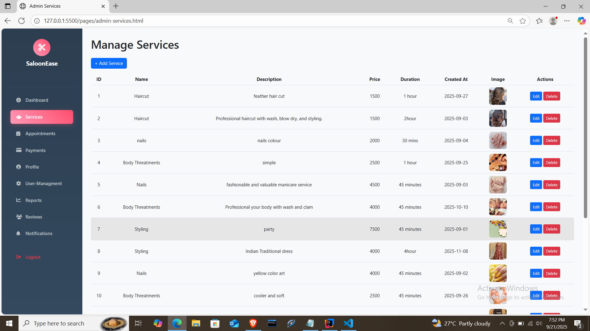

### 🔔 Admin Notifications
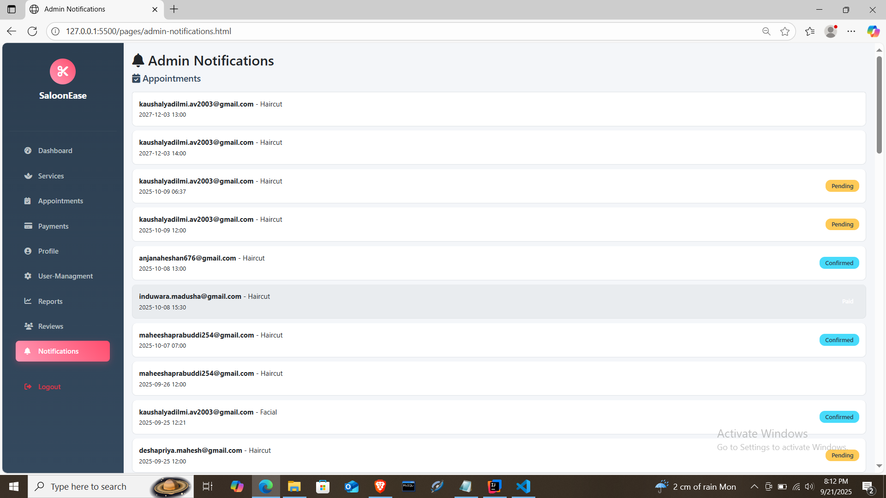

### 👥 User Management
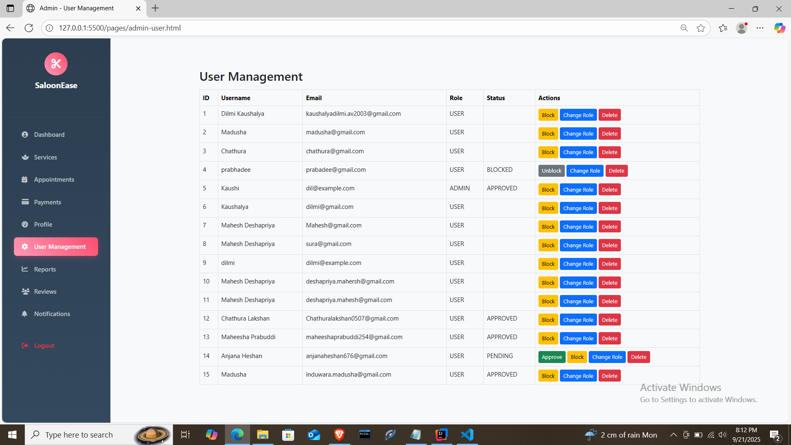

### ✅ Appointment Confirmation
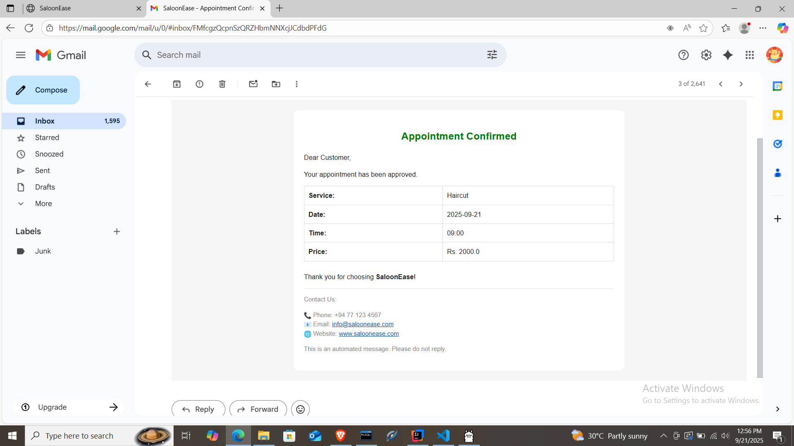

### 💳 Payment Integration
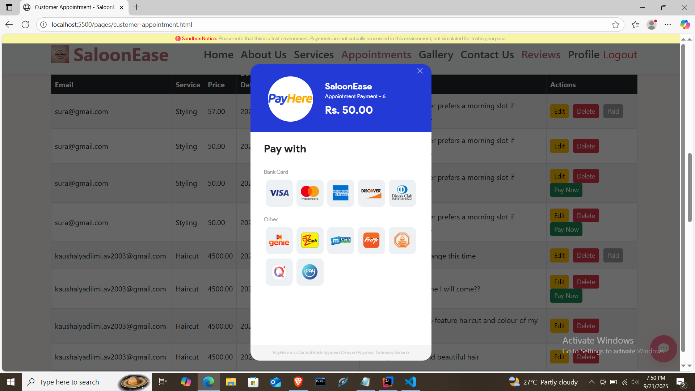

### 🎉 Payment Success
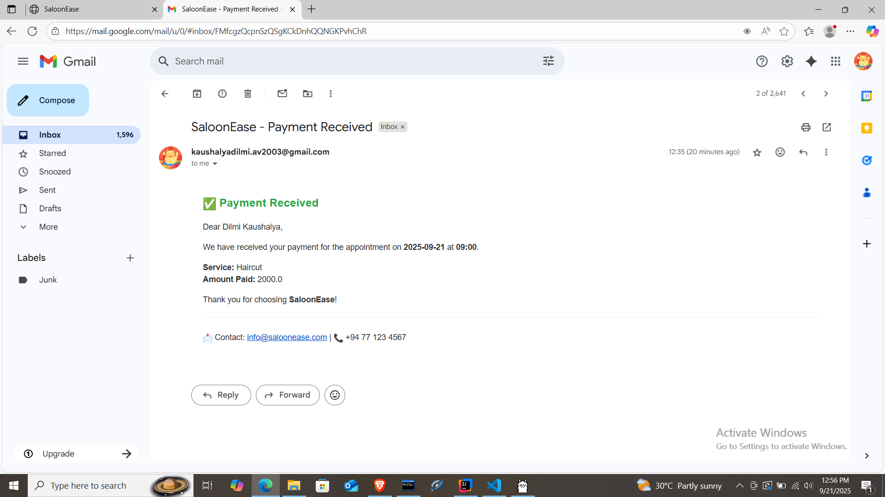

### 💰 Bill Generation
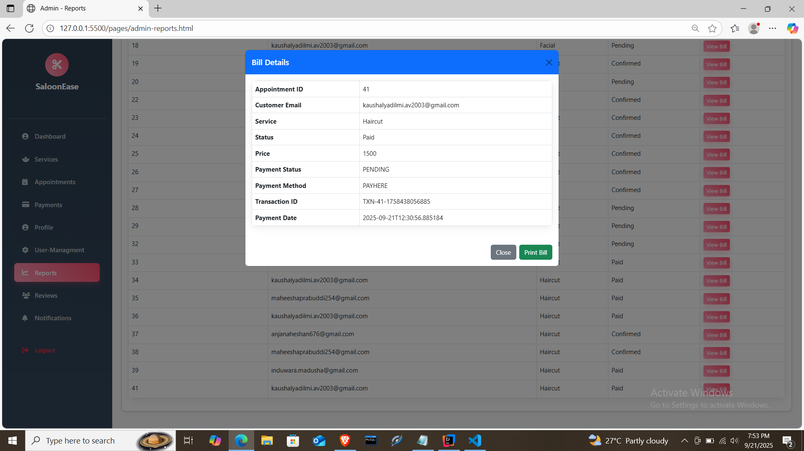

### 👤 Customer Dashboard
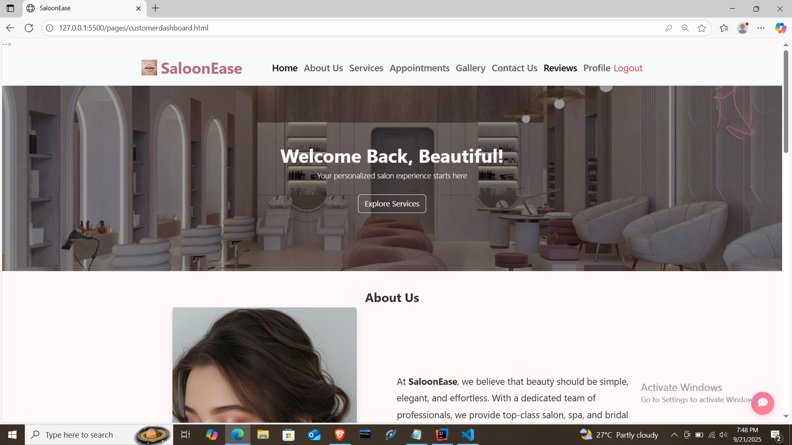

### 📋 Customer Appointments
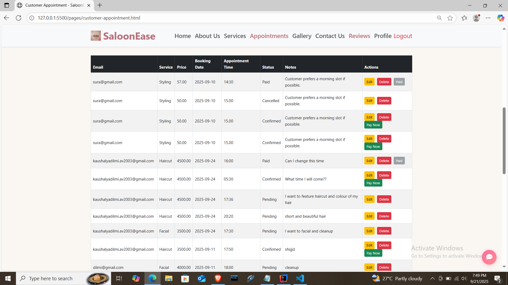

### ⭐ Customer Reviews
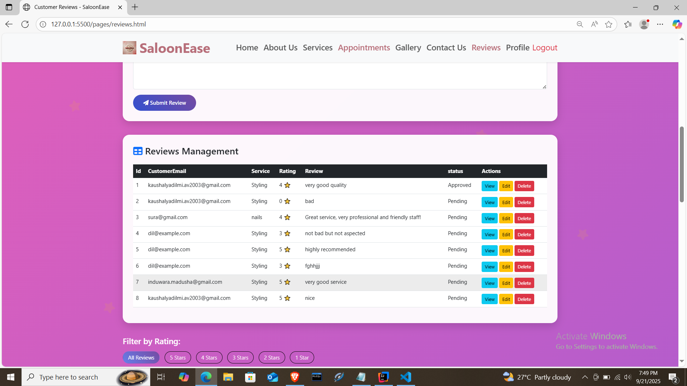

### 🛍️ Customer Services
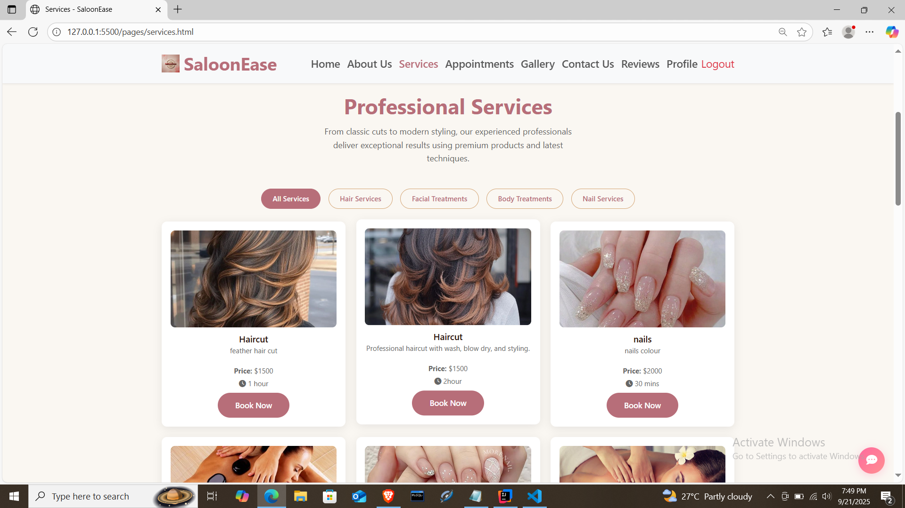

---

## ⚙️ Setup Instructions

### 🔹 Prerequisites
- Java 17+  
- Node.js & npm (if frontend is separate)  
- MySQL Server  
- IDE (e.g. IntelliJ IDEA, VS Code)

### 🔹 Backend Setup (Spring Boot)

1. Clone the repository:  
   ```bash
   git clone https://github.com/your-username/saloon-ease.git
   cd saloon-ease/backend
   ```

2. Configure the database in `application.properties`:
   ```properties
   spring.datasource.url=jdbc:mysql://localhost:3306/saloonease
   spring.datasource.username=root
   spring.datasource.password=yourpassword
   spring.jpa.hibernate.ddl-auto=update
   spring.jpa.show-sql=true
   ```

3. Run the backend:
   ```bash
   mvn spring-boot:run
   ```

4. Backend server will start at:
   ```
   http://localhost:8080
   ```

### 🔹 Frontend Setup (HTML, CSS, JS)

1. Navigate to the frontend folder:
   ```bash
   cd saloon-ease/frontend
   ```

2. If using static HTML files, open `index.html` in browser, or use Live Server / simple static server.

3. Make sure API URLs in frontend JS point to `http://localhost:8080/api/v1/...`.

---

## 🎥 Demo Video

Watch the walkthrough of **SaloonEase** here:

👉 [SaloonEase Project Demo](https://youtu.be/gxzR-__hInk)

---

## 👩‍💻 Features Overview

### Customer Workflow
- Sign Up / Sign In with JWT Authentication
- Browse services and gallery
- Book appointments online
- Receive email confirmations after admin approval
- Make secure payments via PayHere
- View bills after admin approval
- Submit reviews
- Manage profile

### Admin Workflow
- Manage services (create, update, delete)
- View and approve/decline appointments
- Send confirmation emails to customers
- Approve payments & bills
- Generate reports & analytics
- Manage reviews

---

## 🛠️ Tech Stack

- **Backend:** Spring Boot, Java, JWT Authentication
- **Frontend:** HTML, CSS, JavaScript, Bootstrap
- **Database:** MySQL
- **Payment Gateway:** PayHere
- **Email Notifications:** JavaMail API
- **Data Visualizations:** Chart.js

---

## 👨‍🏫 Author

**Dilmi Kaushalya**  
Graduate Diploma in Software Engineering – IJSE
